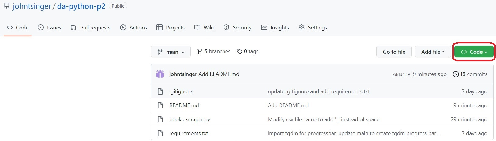
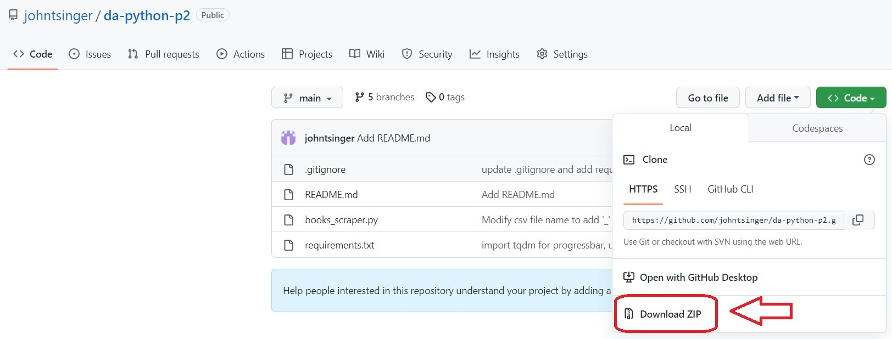
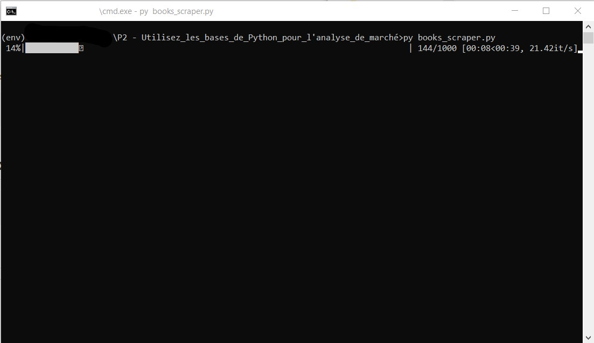

# Dévelopeur d'application Python - P2 - Utilisez les bases de Python pour l'analyse de marché

## Déscription

Scraper en python du site [Books to Scrape](http://books.toscrape.com/). Extrait les données de tous les livres du site et les enregistre dans des fichiers
csv distincts nommés au nom de la catégorie et horodatés au format ISO 8601 `<nom_de_la_catégorie_YYYYMMDDTHHMMSS>.csv` trier par catégories dans des dossiers
nommés `<nom_de_la_catégorie>/`, dans un dossier à la racine du projet nommé `scraped_data/` 

Enregistre aussi les images des livres de chaque catégorie dans des fichiers jpg nommés `<titre_du_livre>.jpg` dans un dossier nommé `images/`
se trouvant dans les dossiers `<nom_de_la_catégorie>/` du dossier `scraped_data/` :
- `projet/`
  - `scraped_data/`
    - `<nom_de_la_catégorie>/`
      - `images/`
        - `<titre_du_livre>.jpg`
      - `<nom_de_la_catégorie_YYYYMMDDTHHMMSS>.csv`

## Guide d'installation

### Cloner le projet avec Git  :

    git clone https://github.com/johntsinger/da-python-p2.git
    
ou

### Télecharger l'archive du projet :

- Aller sur la page du projet
- Cliquer sur Code

    
  
- Cliquer sur download ZIP :

    
     
- Extraire le fichier.

### Installer python :

**Nécessite python3.8 ou supérieur**

Si vous n'avez pas python3 ou vous avez une version antérieur à python 3.8 rendez vous sur le site : https://www.python.org/downloads/ et téléchargez le !

### Environement virtuel :

#### Créer un environnement virtuel à la racine du projet :

Ouvrez un terminal de commande et allez à l'emplacement du projet.\
Notez que `<environment name>`  est un nom que vous choississez, par convention on utilise `env`.

    python -m venv <environment name>

#### Activer l'environnement virtuel :

##### windows :

    <environment name>/Scripts/activate
    
##### linux/mac :

    source <environment name>/bin/activate
    
#### Installer les dépendances :

    pip install -r requirements.txt
    
## Exécuter le scraper

    python books_scraper.py

Attendre la fin de l'exécution ! Vous trouverez les données, comme décrit dans la partie [Déscrpition](#déscription), dans le dossier `scraped_data/`.
    
## Contact :
Jonathan Singer - john.t.singer@gmail.com\
Lien du projet : https://github.com/johntsinger/da-python-p2
